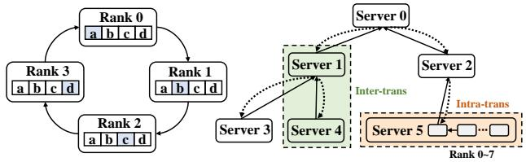
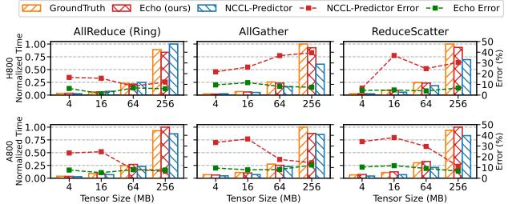

# Echo: Simulating Distributed Training At Scale

Yicheng Feng1 Yuetao Chen1 Kaiwen Chen1 Jingzong Li2 Tianyuan Wu3 Peng Cheng4 Chuan Wu5 Wei Wang3 Tsung-Yi Ho1 Hong Xu1

*1The Chinese University of Hong Kong 2The Hang Seng University of Hong Kong 3HKUST 4Microsoft Research 5The University of Hong Kong*

### Abstract

Simulation offers unique values for both enumeration and extrapolation purposes, and is becoming increasingly important for managing the massive machine learning (ML) clusters and large-scale distributed training jobs. In this paper, we build Echo to tackle three key challenges in large-scale training simulation: (1) tracing the runtime training workloads at each device in an ex-situ fashion so we can use a single device to obtain the actual execution graphs of 1K-GPU training, (2) accurately estimating the collective communication without high overheads of discrete-event based network simulation, and (3) accounting for the interference-induced computation slowdown from overlapping communication and computation kernels on the same device. Echo delivers on average 8% error in training step—∼3x lower than state-of-the-art simulators—for GPT-175B on a 96-GPU H800 cluster with 3D parallelism on Megatron-LM under 2 minutes.

### 1 Introduction

The unprecedented success of large language models (LLMs) has been driven in large part by the large-scale infrastructures that allow the model and training dataset to scale. Organizations have constructed massive clusters with tens of thousands of GPUs to train models with hundreds of billions or even trillions of parameters [\[8,](#page-13-0) [18,](#page-13-1) [24\]](#page-13-2), in a continuous stride to improve model capabilities as promised by the scaling law [\[25\]](#page-14-0).

Training LLMs on such massive scales consumes substantial time and financial resources. On the other hand distributed training is inherently complex and rapidly evolving, involving a myriad of algorithm/model innovations (linear attention [\[26\]](#page-14-1)), parallelism strategies [\[29,](#page-14-2) [35,](#page-14-3) [38,](#page-14-4) [48\]](#page-15-0), operation and kernel optimization (kernel fusion [\[14\]](#page-13-3)), and hardware designs [\[1\]](#page-13-4). As a result, accurate simulation of distributed training has started to garner attention as an essential tool to effectively manage training infrastructures and systems [\[11,](#page-13-5) [15,](#page-13-6) [19,](#page-13-7) [30,](#page-14-5) [44\]](#page-14-6).

Broadly, simulation is useful for two main purposes: enumeration and extrapolation. In distributed training context, simulation can be used to enumerate combinations of parallelism strategies, optimization techniques, and hardware configurations that are available in the current cluster, to derive the optimal training plan for a given job and to determine efficient resource allocation schedules across jobs. Simulation is also useful (perhaps more so) to extrapolate beyond what is currently available, which is paramount for strategic decision making such as capacity planning [\[24,](#page-13-2) [38\]](#page-14-4) that involve many what-if questions with significant impact. For example, what speed-up can be achieved by scaling the current cluster by a factor of 3, or by increasing the network bandwidth by 2x? This also greatly facilitates the development of new optimizations, which only need to be prototyped on a small scale for the simulator to extrapolate its potential benefits on a large scale quantitatively.

Prior work has made salient progress in training simulation [\[11,](#page-13-5)[15,](#page-13-6)[19,](#page-13-7)[30,](#page-14-5)[44\]](#page-14-6). Yet, they fall short in three key aspects that hinder their capabilities in supporting both enumeration and extrapolation practically.

First, modern large-scale training often employs 3D parallelism, a combination of data parallelism (DP), tensor parallelism (TP), and pipeline parallelism (PP), to break down the large models along different dimensions into sub-models that fit into a device's memory and maximize cluster resource utilization. To accurately simulate 3D parallelism, one needs to obtain the training workloads, which encompass the deviceor rank-specific execution graphs detailing the computation and communication operations and their dependencies. Existing work [\[11,](#page-13-5) [19,](#page-13-7) [30,](#page-14-5) [31,](#page-14-7) [49\]](#page-15-1) requires a full-scale cluster deployment of the job to trace the training workloads from each and every device at runtime. This is because each device builds its own execution graph independently in parallel during job initialization to most efficiently carry out training of its unique sub-model according to the 3D parallelism setting and various optimization techniques (e.g. kernel fusion). The *in-situ* tracing approach is clearly very costly and sometimes even impractical for extrapolation usecases.

Second, simulating collective communication (CC) (e.g. all-reduce) is critical because (1) it pieces all the devices and nodes together according to the various parallelisms, and

(2) its performance can often be the bottleneck [\[16,](#page-13-8)[20,](#page-13-9)[24,](#page-13-2)[32\]](#page-14-8). However, most existing work [\[15,](#page-13-6) [19,](#page-13-7) [30,](#page-14-5) [44,](#page-14-6) [49\]](#page-15-1) rely on a coarse-grained α-β model [\[40\]](#page-14-9) without considering the actual communication patterns and optimizations in the implementation, resulting in significant simulation errors. On the other hand, more recent work such as SimAI [\[11\]](#page-13-5) explicitly simulates each peer-to-peer send and receive primitive of a CC kernel using a packet-level event-based network simulator such as ns-3 [\[36\]](#page-14-10). This fine-grained approach provides high accuracy at the cost of prohibitive overheads even at a medium scale: simulating a 128-GPU job takes SimAI over 2 hours with an optimized ns-3 implementation ([§2.3\)](#page-2-0).

Third, we observe that overlapping communication and computation operations, an optimization widely used to improve efficiency [\[13,](#page-13-10)[24,](#page-13-2)[46\]](#page-15-2), incurs non-negligible slowdowns to the computation due to contention for shared resources (e.g., cache, DRAM bandwidth) [\[15,](#page-13-6) [21\]](#page-13-11). This, however, has largely been overlook in prior work thus far. Simulating interference-induced slowdown is particularly challenging since it depends on many idiosyncrasies ranging from scheduling logic of the ML framework and the underlying library to hardware-specific implementation optimizations. Much of these details are vendor-proprietary and inaccessible.

In this work, we propose Echo, a practical simulation platform for large-scale distributed training. Echo is built with three key design choices. (1) It adopts an *ex-situ* tracing approach to accurately capture training workloads using just a single device, avoiding the need for a full-scale cluster deployment. The key technical idea here is to transform the parallel initialization process at each rank into a sequential one, allowing a single device to act as each rank iteratively to trace the corresponding execution graph. (2) It employs white-box modeling to simulate a CC kernel's performance with four parts: connection setup overhead, intra-server and inter-server transmission, and possible data reduction time. The model is supplemented with exhaustive profiling to obtain key parameters (e.g. chunk size which determines number of rounds of transmission for a message) optimized by CC libraries like NCCL for different hardware features and software configurations that affect the individual components above. This hybrid approach strikes a good balance between accuracy and efficiency. (3) It introduces an black-box MLbased slowdown predictor to model the slowdown caused by overlapping operations. The XGBoost-based predictor relies on categorical features such as transmission protocol and channel configuration in NCCL, to numerical kernel-level performance statistics such as streaming multiprocessors (SM) occupancy and DRAM utilization, to capture their complex interactions.

We implement Echo to support mainstream training frameworks: PyTorch, DeepSpeed [\[34\]](#page-14-11), and Megatron-LM [\[38\]](#page-14-4). Our implementation with ∼10k LoC also includes a suite of automation tools to facilitate workload tracing and runtime profiling. We evaluate Echo on H800 and A800 clusters

Figure 1: Overview of the technical stack and architecture for large-scale model training.

across a variety of scenarios and models, achieving an average prediction accuracy of 91.4% in training step time, and is up to 3x better than the state-of-the-art. For 96-GPU training of GPT-175B, Echo achieves 92% accuracy in less than 2 minutes. We plan to open source Echo to the community.

### 2 Background and Motivation

### 2.1 Large-scale Distributed DNN Training

Figure [1](#page-1-0) illustrates the layered technical stack underlying large-scale training, from high-level models and frameworks to low-level GPU libraries and networked systems. Today's state-of-the-art models often exceed 100 billion parameters [\[8,](#page-13-0) [23\]](#page-13-12), and recent GPU architectures (e.g., NVIDIA Hopper and Ampere) combined with high-speed interconnects (e.g., InfiniBand and RoCE) enable efficient training at the scale of thousands of GPUs. New parallelization techniques—such as 3D parallelism [\[38\]](#page-14-4), communicationcomputation overlap [\[42\]](#page-14-12), and ZeRO [\[33\]](#page-14-13)—further refine resource utilization, accelerating the convergence of these massive models.

ML frameworks. Modern large-scale training frameworks, such as Megatron-LM [\[38\]](#page-14-4) and DeepSpeed [\[34\]](#page-14-11), have become de facto standards in production settings at companies like Microsoft, NVIDIA, and Alibaba [\[11,](#page-13-5) [34,](#page-14-11) [38\]](#page-14-4). These frameworks implement 3D parallelism—combining DP, TP, and PP—to efficiently scale model training across large GPU clusters. In brief, DP replicates the model and splits the data, TP divides model parameters among GPUs, and PP stages model layers for pipelined execution. Together, these methods accelerate training of hundred-billion-parameter models. Furthermore, kernel-level overlap techniques (e.g., communicationcomputation overlap) and optimized kernels further minimize idle times and improve scaling efficiency.

Communication library. Collective Communication Libraries (CCLs) facilitate efficient data transfer across GPUs in distributed systems [\[43\]](#page-14-14). Among these, NCCL is the most widely adopted in production environments [\[11,](#page-13-5) [34,](#page-14-11) [38,](#page-14-4) [43\]](#page-14-14), providing core communication primitives such as

| Simulator      | Training Workload     |                    | Communication      | 3D Parallelism | Overlap Slowdown |  |
|----------------|-----------------------|--------------------|--------------------|----------------|------------------|--|
|                | Framework-specific op | Ex-situ simulation |                    |                |                  |  |
| FlexFlow [22]  | ✗                     | ✓                  | α−β model          | ✓              | ✗                |  |
| Daydream [49]  | ✓                     | ✗                  | α−β model          | ✗              | ✗                |  |
| dPRO [19]      | ✓                     | ✗                  | α−β model          | ✗              | ✗                |  |
| DistSim [30]   | ✓                     | ✗                  | α−β model          | ✓              | ✗                |  |
| Astra-sim [44] | ✗                     | ✗                  | α−β model          | –              | ✗                |  |
| Proteus [15]   | ✗                     | ✓                  | α−β model          | ✓              | –                |  |
| SimAI [11]     | ✓                     | –                  | Event-driven       | –              | ✗                |  |
| Echo (ours)    | ✓                     | ✓                  | White-box modeling | ✓              | ✓                |  |

Table 1: Comparison of key features across simulators. ✓ indicates full support, ✗ indicates no support, and – denotes partial or conditional support. Simulators are evaluated on training workload generation (framework-specific operations, ex-situ simulation), communication modeling, support for 3D parallelism, and handling of overlap-induced slowdowns.

all-reduce, all-gather, and reduce-scatter. NCCL serves as the default communication backend for mainstream training frameworks and incorporates numerous optimizations, including advanced topological algorithms and protocols that decompose data transmission into efficient point-topoint (P2P) transfers.

### 2.2 Design Goals

The overarching goal of this work is to build a practical simulator for large-scale distributed training. Specifically, we aim to achieve the following goals:

- High accuracy. The basic goal is to accurately predict the end-to-end training step time.
- Ex-situ simulation. if the simulator's input is collected by deploying the job to the target cluster at full scale, i.e. *in-situ* simulation, its utility is fundamentally limited by the available resources. To be able to explore scales and scenarios beyond what is currently available, we desire *ex-situ simulation* design that can simulate a 1k-GPU cluster using a single machine for example.
- High efficiency. The simulator should be fast with minimal computational overhead especially for large-scale settings.
- Usability. The simulator should support mainstream training frameworks, models, and parallelism strategies. It must also be easy to use, automating the process as much as possible to minimize manual effort.

### 2.3 Challenges

Training simulation has started to attract attention recently [\[11,](#page-13-5) [15,](#page-13-6) [19,](#page-13-7) [30,](#page-14-5) [44\]](#page-14-6). Inspired by prior work, we also separately consider computation and communication, and computation can be relatively easily simulated by offline profiling on a single device. Yet, to achieve the four design goals, we identify three key challenges that prior work has not fully addressed. Table [1](#page-2-1) summarizes the comparison between Echo and existing simulators.

Before we discuss the challenges, we note that all experi-

ments in this section are done on a NVIDIA A100 GPU cluster. Each 8-GPU node in the cluster has 600 GB/s NVLINK intra-node bandwidth, and four Mellanox ConnectX-6 NICs each with 2x100 Gbps. Training and bus bandwidth tests are performed using PyTorch's DDP and NCCL-test [\[4\]](#page-13-14), respectively.

#### Challenge 1: *How to obtain the actual training workloads without a full-scale deployment?*

Accurate ML training simulation relies on the so-called training workload as the foundation. The *training workload* refers to the execution graph that encodes the dependencies or execution sequence of computation and communication operators, plus other necessary information like tensor shapes and data types. It serves as the blueprint for replaying the training process (on a given device). In large-scale 3D parallelism training, each GPU device (rank) independently initializes its assigned submodel based on TP and PP, resulting in unique workloads per rank. These workloads are established only when the training framework begins execution.

Thus for accuracy, one naturally adopts a runtime tracingbased approach to capture the training workloads [\[19,](#page-13-7) [30,](#page-14-5) [31,](#page-14-7) [49\]](#page-15-1): the per-device execution graph is extracted after each device builds its execution graph in parallel. Yet this assumes a full-scale deployment of the job on the cluster, which severely limits the practical utility of the simulator in large-scale settings and is exactly one of the main motivations for building a simulator. Some systems like Proteus [\[15\]](#page-13-6) and ASTRA-sim [\[44\]](#page-14-6) choose to manually distribute and maintain the operators and generate the training workloads in order to avoid this limitation. However, this hand-crafted approach is inherently imprecise since it fails to accurately represent the nuanced runtime characteristics of *framework-specific operations*—custom or highly optimized operations tightly integrated with a particular framework's execution model (see [§8.2\)](#page-8-0). Such operations often rely on environment-specific optimizations that emerge only under full-scale deployment conditions. Without capturing these contextual factors, manually approximating operation behavior becomes guesswork, lead-

Figure 2: Bus bandwidth of all-reduce communication operation with varying message sizes and GPU counts, profiled on A100 clusters.

ing to substantial inaccuracies. For instance, we observed that ASTRA-sim overestimated computation operation by over 100% on A800 GPUs when running Megatron-LM workloads. How to faithfully capture the training workloads without a full-scale deployment becomes our first challenge.

#### Challenge 2: *How to accurately simulate collective communication without high overheads?*

Communication operations are critical in distributed training, yet hard to simulate as they involve complex interactions among devices and machines, and are affected by a range of network factors such as topology, latency, congestion control, etc. Existing approaches fall into two categories. Most simulators like ASTRA-sim [\[44\]](#page-14-6), FlexFlow [\[22\]](#page-13-13), Proteus [\[15\]](#page-13-6), and NCCL-Predictor [\[9\]](#page-13-15) adopt a α−β model [\[40\]](#page-14-9), which essentially calculates the running time of a communication operation as *tensor*\_*size*/*bandwidth*+*latency*. Figure [2](#page-3-0) shows the most advanced NCCL-Predictor greatly overestimates the effective bus bandwidth of all-reduce operations especially for smaller messages. Note NCCL-Predictor already uses additional parameters to account for the impact of hardware, communication protocols (TCP vs RDMA), and algorithms (ring vs tree for all-reduce), but the over-simplified α−β model is inherently limited in capturing complex interactions across all these factors. Moreover, NCCL optimizes distributed communication by integrating hardware offloading and acceleration techniques, such as GPUDirect RDMA [\[5\]](#page-13-16) and GDRCopy [\[6\]](#page-13-17), which lead to variations in internal kernel behavior.

The second, more precise approach involves white-box modeling specifically targeting collective communication [\[11,](#page-13-5) [44\]](#page-14-6). Since NCCL (and other CCLs) implements a communication operation as an orchestrated series of P2P send and receive operations, we can simulate each send and receive to compose the end-to-end result. Similar to the training workloads, this naturally reflects the complex optimizations used by CCLs according to topology, NCCL protocol (LL, LL128 or Simple), network interconnect technologies (IB or RoCE), algorithm (ring or tree for all-reduce), etc. To faithfully simulate the send/receive time, prior work [\[11,](#page-13-5) [44\]](#page-14-6) uses packet-level discrete-event network simulators like ns-3 [\[36\]](#page-14-10), which takes the actual topology and profiled link bandwidth as input. Yet packet-level simulation is computationally ex-

| Model      | Overlapped op (%) | Slowdown | Kernel Type | Slowdown |
|------------|-------------------|----------|-------------|----------|
| BERT_Large | 59.2%             | 1.391    | Transform   | 1.142    |
| GPT2       | 59.5%             | 1.481    | Sum         | 1.508    |
| VGG19      | 57.5%             | 1.377    | GEMM        | 1.269    |
| ResNet152  | 57.9%             | 1.435    | Grad        | 1.613    |

Table 2: Statistics about (1) the proportion of overlapped kernels in different models and the slowdown factors in training step time, and (2) slowdown factors of some common computation operations. Training is done on a single 8-GPU node of our A100 cluster with other settings unchanged; all-reduce is the only communication operation here in PyTorch DDP.

pensive as it needs to simulate the entire protocol stack at each node in the network: We run the most recent SimAI [\[11\]](#page-13-5) with an optimized multi-thread ns-3, and observe that simulating a single iteration on a 128-GPU cluster takes over 2 hours (7655s) on a 32-core server. Therefore, the challenge is how to scale the white-box communication simulation efficiently without sacrificing accuracy.

#### Challenge 3: *How to account for the interference between overlapping computation and communication?*

Overlapping computation and communication is widely used in practice to improve training efficiency and hardware utilization [\[13,](#page-13-10) [24,](#page-13-2) [46\]](#page-15-2). We find that overlapping introduces non-negligible slowdowns especially to computation operations, even though they are assigned to separate streams on the GPU (contention for shared memory may be a possible cause). Here, we define the slowdown factor as the ratio of the running time with overlapping communication kernels to the running time without communication kernels. As shown in Table [2,](#page-3-1) more than 50% computation operations overlap with communication, leading to a slowdown of up to 1.48x in training step time. We also examine the slowdown to individual kernels. Table [2](#page-3-1) (second column group) shows when overlapped with all-reduce with 25MB messages, running times of common kernels increase by an average of 37.76%. The CDF of slowdown factors for all computation kernels of GPT-2 is presented in Figure [3,](#page-4-0) where slowdown can reach 8 with an average of 1.70. Some recent work [\[21\]](#page-13-11) also reported similar slowdowns in production training clusters. Unfortunately, this phenomenon has been overlooked by most existing simulation work despite its salient impact. The only work we know that considers this is Proteus [\[15\]](#page-13-6): it simply uses a

| GPU  | Kernel                         | CUDA | Slowdown |
|------|--------------------------------|------|----------|
|      | GEMM                           | 11.8 | 1.264    |
| 3090 | GEMM                           | 12.1 | 1.393    |
|      | LayerNorm                      | 11.8 | 1.180    |
|      | Timeline Composer LayerNorm | 12.1 | 1.938    |
|      | GEMM                           | 11.8 | 1.134    |
| A800 | GEMM                           | 12.1 | 1.178    |
|      | LayerNorm                      | 11.8 | 1.091    |
|      | LayerNorm                      | 12.1 | 1.207    |

Figure 3: CDF of slowdown factor of various kernels in GPT2.

Table 3: Performance comparison of CUDA kernels on different GPU architectures, showing execution slowdown across various CUDA versions.

heuristic factor that varies only with GPU architecture and ML model to obtain the slowdown, which is too coarse to be accurate and not generalizable to unseen models.

**Transformer Layer**

Simulating the interference-induced slowdown is a daunting task. We ideally would need to model the kernel-level behavior in order to precisely know how different kernels overlap. For example, in the widely-used gradient overlap optimization [\[46\]](#page-15-2), the simulator must correctly replay the backpropagation computation kernels and schedule communication kernels at precise times to achieve accurate overlap. Further, for a given computation kernel, its slowdown factor is influenced by various factors of hardware and software setup. Table [3](#page-4-0) shows the slowdown factors of two kernels on different GPUs and CUDA versions vary a lot. This is because the internal implementation, which varies based on the factors above, ultimately determines how resources are scheduled and shared among concurrent kernels. These proprietary details are extremely inaccessible for us, not to mention the complexity of modeling them. Thus, how to practically simulate the effect of overlapping computation and communication remains a formidable challenge. *Timeline Composer*

### 3 Design Overview

Building upon the aforementioned observations and motivations, we introduce Echo, a simulator tailored for large-scale distributed training.

Key design choices. We highlight the key choices in building Echo to address the three challenges in [§2.3.](#page-2-0)

- To obtain training workloads without a full-scale deployment, Echo employs a novel ex-situ tracing approach. Generally, ML frameworks support various parallelism in distributed training in the following way: (1) they initialize each rank (typically one rank per device) with its own submodel based on the parallelism setting, and then (2) each rank builds its own execution graph to start actual training. Echo turns this parallel process into a sequential one, using only one device to act as each rank iteratively to trace the corresponding execution graph and profile the running time of each operation at the same time, achieving faithful workload tracing without requiring the full cluster.
- To achieve efficient communication simulation without high

**User config User config**

**User config**

Workload Extraction

*Rank0*

**Runtime manager**

*Slowdown Validator*

Figure 4: Echo architecture overview. The green components represent the core modules of Echo.

overheads, Echo employs a white-box modeling approach with empirically profiled parameters that strikes a good balance between accuracy and efficiency. Our model is derived closely after NCCL's underlying chunk-based implementation of collective communication capturing critical factors such as per-chunk inter-server transmission time. These factors are profiled offline exhaustively to capture the complex dynamic optimization by NCCL according to hardware features and software configurations.

• To account for the interference between overlapping computation and communication, Echo adopts a black-box method using features related to both computation and communication kernels, such as bucket size, SM occupancy, and cache hit rate.

System architecture. Figure [4](#page-4-1) shows Echo's architecture. Its input includes three categories: user-defined settings specifying the training framework, parallelism strategies (DP/TP/PP groups); model details defining the model structure and hyperparameters; and hardware configurations detailing device specifics (GPU type), cluster size, network topology, NCCL parameters (e.g., NCCL\_TOPO\_FILE, NCCL\_BUFFSIZE), etc. Given these inputs, the *workload tracer* extracts training workloads for each rank, including the per-rank execution graph and operation running times ([§4.1\)](#page-5-0). The *CC estimator* module ([§5\)](#page-5-1) leverages the white-box models with parameters corresponding to the given settings to estimate each communication kernel's performance. Then the *timeline composer* module ([§4.2\)](#page-5-2) re-constructs the global timelines of the endto-end training process by assembling all per-rank execution graphs with estimated communication operation performance and inter-rank dependencies. The *validator* module ([§6\)](#page-7-0) applies a machine learning model to adjust the running times of overlapping operations, accounting for the interferenceinduced slowdown, and outputs the final training step time result. Additionally, Echo maintains a *database* for profiling data, reducing redundant measurements across simulations.

Figure 5: Echo's MPU module and workload tracer.

### 4 Workload Tracing

We first present in this section how Echo accurately traces the training workloads for each rank in an ex-situ fashion using a single device, thereby addressing Challenge 1 ([§2.3\)](#page-2-0). We also show how Echo composes the global timelines across devices using the per-rank workloads to faithfully re-construct the entire training process in [§4.2.](#page-5-2)

### 4.1 Per-Rank Workload Tracing

To launch a training job, the ML framework registers the global parallelism parameters (e.g. DP/TP/PP groups) given by user into the so-called model parallelism unit (MPU), which maintains all states related to parallelisms for a given rank. Then according to the MPU, each rank concurrently initializes its own part of the model that it needs to train for (Figure [5](#page-5-3) ⃝1 ), and starts training with an execution graph that is optimized for its submodel based on the hardware/software environment and user configurations.

Echo extracts the per-rank execution graph in an ex-situ fashion by transforming the above parallel process into a sequential one (Figure [5](#page-5-3) ⃝2 ). Specifically, Echo hijacks all the calls to the original MPU and re-directs them to its own MPU, and registers the global parallelism parameters as usual. Echo's MPU only manipulates the input arguments to the MPU when necessary; it does not change the original implementation to ensure correctness. Then with a single device, in each iteration *i*, Echo uses this unique rank ID *i* to initialize the corresponding submodel and execute one complete training step, so all information regarding the computation operations, including their dependencies (including those w.r.t other ranks) and running times, can be profiled.

The caveat here is collective communication: one device obviously cannot execute a communication operation. To resolve this, notice that when the communication operation is launched it also needs to call into the MPU which determines the device's position in the global communication groups for proper execution. This is re-directed to Echo's MPU again allowing it to trace the communication operation's truthful information in the simulated setting (group association, mes-

Figure 6: Illustration of how Echo schedules operators in the execution graph to timelines across ranks.

sage sizes, etc.); meanwhile, instead of returning results using the simulated (distributed) setting, Echo's MPU returns results corresponding to single device setting, so the communication operation can proceed and training is not blocked. This way Echo traces the actual execution graphs for each rank and running times of computation operations without requiring the full-scale cluster. Implementation details of tracing vary across frameworks which we will discuss in [§7.](#page-7-1)

Note that after per-rank workload tracing, all collective communication operations on the per-node execution graph are placeholders without any running time. The job of Echo's CC estimator and validator is precisely to estimate and refine the communication times, respectively, in the next phase.

### 4.2 Timeline Composing

Before presenting the communication estimation and validation, we discuss how Echo obtains the end-to-end training step time by composing the global timeline with the per-rank workloads obtained above.

Assuming all communication running times are known, Echo's timeline composer can recover the training process by replaying the per-rank execution graphs. Timeline composer is an event-driven simulator that walks through the per-rank execution graphs and puts all operations (events) onto the global timelines accordingly, including the computation timeline, communication timeline, and memory copy (memcpy) timeline. As shown in Figure [6,](#page-5-4) a critical piece of information missing from the per-rank graphs is dependencies across ranks; for instance the downstream stages in rank *i* requires activations from the upstream stages in rank *i*−1 before starting the forward computation in PP. We provide predefined dependencies and matching rules for both inter-stage and intra-stage events for common parallelism strategies, such as 1F1B. To enhance flexibility, this module is exposed as an API, allowing users to input new dependencies and matching rules for custom strategies.

Figure 7: Illustration of ring-based (left) and tree-based (right) communication execution. In the tree-based communication, black solid arrows denote the reduce process, while dashed arrows indicate the broadcast process.

### 5 Communication Estimation

In this section, we outline our approach to simulate the running time of communication operations. We provide some key background on NCCL in [§5.1](#page-6-0) as the basis of our approach. Then we present our white-box modeling in [§5.2](#page-6-1) and [§5.3](#page-6-2) for synchronization and execution time of a communication kernel, respectively, in addressing Challenge 2 of [§2.3.](#page-2-0)

### 5.1 Background on NCCL

NCCL provides collective communication (CC) functions, such as all-reduce, all-gather, and reduce-scatter, to support various parallelisms in training. These operations have a variety of implementations optimized for different algorithms, protocols, etc.

In NCCL, P2P primitives and CC functions are implemented within a single CUDA kernel [\[9\]](#page-13-15). Thus, our modeling and prediction here is done directly at the kernel level. The kernel-level results are used as the corresponding operation's performance. This results in inaccuracies since the launching overhead of the operation is not considered, which however is very small. The same applies to the slowdown prediction in [§6.](#page-7-0)

Each message is divided into equal-sized chunks that are pipelined for efficient synchronization and transfer. This is the basis of our modeling in [§5.3.](#page-6-2)

NCCL supports two common algorithms for all-reduce: ring-based [\[9\]](#page-13-15) and tree-based [\[3\]](#page-13-18). Figure [7](#page-6-3) illustrates how they work. Other CC kernels use ring-based algorithm only.

### 5.2 White-Box Modeling: Synchronization

Echo models a NCCL kernel as two sequential stages: synchronization and execution. Upon invocation, the kernel first checks whether it can start execution based on the readiness of ranks in the current communication group. If not all ranks are ready, the kernel waits for synchronization before it can proceed. Thus, the total running time of a kernel is the sum of synchronization time and execution time. Here we investigate the synchronization time first.

Echo models synchronization time after NCCL's implementation logic. For P2P send and receive, it waits until its target communicator (i.e., each rank's communicator instance) is ready to proceed. In contrast, for CC kernels, the communicator associated with each rank in the current group

must wait until all communicators have been successfully launched. The last communicator to initiate determines the actual start time of this kernel.

### 5.3 White-Box Modeling: Execution

Execution time represents the majority of kernel running time, and is the focus of our modeling. We build white-box models to closely model the kernel execution process in NCCL with different algorithms, and profile all the key parameters of the models exhaustively in various hardware/software settings to achieve accurate prediction without high overheads of eventbased simulation.

Basic model. Based on NCCL's GPU-side implementation, the execution time of a CC kernel can in general be broken down into four non-overlapping components, using all-reduce as the example:

$$\begin{split} T\_{\text{comm\\_kernel}} &= T\_{\text{comm\\_setup}} + T\_{\text{intra\\_trans}} \\ &+ T\_{\text{data\\_reduction}} + T\_{\text{inter\\_trans}}, \end{split} \tag{1}$$

where *Tconn*\_*setup* is the connection setup time; *Tintra*\_*trans* and *Tinter*\_*trans* are times to transmit the tensor chunks in the specific algorithm, *Tdata*\_*reduction* is the computation time of the reduce operation over the received tensor chunks with the local tensor. Not all components are present in other CC kernels.

Based on Equation [\(1\)](#page-6-4), we can formulate the following for all CC kernels with different algorithms:

$$T\_{all-gate}^{Ring} = \alpha + \gamma \cdot \eta (N-1),\tag{2}$$

$$\begin{split} T\_{reduce-center}^{Ring} &= \mathfrak{a} + \mathfrak{n} \left[ (N-1) + \mathfrak{y} \times (N-1) \right] \\ &+ \mathfrak{d} \times tensor\\_size, \end{split} \tag{3}$$

$$\begin{split} T\_{all-reduce}^{Ring} &= \mathfrak{a} + \mathfrak{n} \left[ (N-1) + \mathfrak{y} \times 2(N-1) \right] \\ &+ \mathfrak{d} \times tensor\\_size, \end{split} \tag{4}$$

$$\begin{split} T\_{all-reduce}^{Tree} &= \alpha + \gamma(\eta - 1) + 2\mathfrak{J}(K - 1) \\ &+ 2\eta \log\_2(M) + \mathfrak{d} \times tensor\\_size. \end{split} \quad (5)$$

Here *N* is the total number of devices, *M* number of nodes (servers), and *K* = *N*/*M* number of devices per node. We denote the connection setup time as α, intra-server and interserver transmission times as β and γ. The reduce time depends on *tensor*\_*size*, and the reduce throughput δ. Finally, η is the number of rounds or number of chunks for this tensor, which corresponds to NCCL's chunk-based implementation.

Offline exhaustive profiling. The modeling above is explicitly related to nine parameters and implicitly related to an additional parameter, *chunk*\_*size*. Among them, *N*, *M*, *K* and *tensor*\_*size* are user configurations while α,β, γ,δ, η are what Echo attempts to obtain. However, modeling them explicitly is challenging. First, they obviously depend on *chunk*\_*size* and *tensor*\_*size*. The chunk size is not a predefined constant but dynamically tuned by NCCL [\[9\]](#page-13-15). Further, they also vary

| Type                      | Feature                                                                                                                        | Specification                                                                                                                                                                                                                                          |
|---------------------------|--------------------------------------------------------------------------------------------------------------------------------|--------------------------------------------------------------------------------------------------------------------------------------------------------------------------------------------------------------------------------------------------------|
| Comm. details          | Protocol Algorithm Collective Bucket size Channel number                                                           | Communication protocol used within NCCL Communication topology algorithm applied in NCCL Name of the collective function in the kernel Size of the tensor bucket used in collective communication Number of communication channels in NCCL |
| Comp. Kernel Metric | Running time Compute throughput Memory throughput DRAM throughput Achieved occupancy L1 hit rate L2 hit rate | Running time profiled on single-device training Average SM throughput Percentage of cycles where DRAM was active Peak DRAM throughput Average percentage of active warps on each SM Hit rate for L1 cache Hit rate for L2 cache      |

Table 4: Features in Echo's prediction model for predicting interference.

with hardware configuration and software implementation (e.g. IB vs NVLink, NCCL version). These idiosyncrasies also vary across different CCLs, making it even more difficult to have a general model.

We adopt offline profiling instead to obtain the values of these parameters, since they are fixed when all the hardware/ software configurations are settled. First, we modify NCCL to be able to obtain the chunk size during the initialization phase. We enumerate all possible combinations of *N*, *M*, *tensor*\_*size*, and hardware type (IB, TCP, NVLink) to record the corresponding *chunk*\_*size* and number of rounds η computed by NCCL. Then for each *chunk*\_*size*, we profile the corresponding connection setup time, intra-server and inter-server transmission time, and reduce throughput (α,β, γ,δ) under the corresponding setting. This does require access to a cluster as the network bandwidth may vary depending on the scale (2-node vs 4-node vs 8-node), but for common Clos-based cluster topologies they remain stable after reaching a small scale due to the symmetry and limited number of tiers.

Taken together, our approach of combining white-box modeling with offline profiled parameters provides a good firstorder estimation of CC kernel performance with very low overheads. Our approach can be enhanced in several ways, which we discuss in [§9.](#page-11-0)

### 6 Overlapping-Induced Slowdown Prediction

Accurately capturing and modeling the resource contention between overlapping kernels presents substantial challenges in predicting the slowdown factor as discussed in [§2.3.](#page-2-0) To address this, Echo introduces an ML-based slowdown prediction model with a number of hardware- and software-specific features, which we present here.

A GPU devices executes concurrent computation and communication kernels with spatial multitasking, where each kernel is assigned to separate streams with a subset of the SMs. At the same time they also contend for shared resources such as cache and DRAM bandwidth. These factors results in performance interference, and Echo needs to capture them in predicting the slowdown.

Feature extraction. Table [4](#page-7-2) summarizes the key features used by our model. We categorize features into two groups: communication-related details and computation kernel metrics. For communication, we consider features such as protocol and algorithm employed by NCCL, CC kernel type, bucket size, and channel configuration. These parameters capture the complexity and overheads of communication: bucket size, for instance, determines when a communication kernel will be launched after accumulating one bucket of data. On the computation side, we profile kernels at a fine-grained level on a single device to measure their baseline performance without overlapping. We collect running times, compute throughput, memory utilization, and cache statistics using NVIDIA Nsight Systems and Nsight Compute. For instance, achieved occupancy and SM activity levels indicate compute intensity, while DRAM utilization and memory throughput—along with L1/L2 hit rates—shed light on memory access latency and potential bottlenecks. Additionally, we classify kernels by their functional types (e.g., matrix multiplication, layer normalization) to further refine our predictions.

XGBoost-based model. We leverage XGBoost [\[2\]](#page-13-19), a treebased gradient boosting framework, to predict the slowdown factors caused by overlapping kernels with the above features. XGBoost is well-suited to this task for two key reasons. First, our dataset contains heterogeneous features that are both numerical (e.g., SM throughput, DRAM utilization) and categorical (e.g., GPU type, kernel type), a scenario where tree-based models excel. Second, our target slowdown factors, influenced by the interplay of diverse system conditions, remain bounded within a range well-captured by the training set. As we expand our dataset—incorporating additional profiles from various models, GPU architectures, and cluster scales—the model's generalization ability improves, enabling accurate slowdown predictions across increasingly complex and heterogeneous environments.

### 7 Implementation

We implement Echo as illustrated in Figure [4.](#page-4-1) Echo is developed based on PyTorch 2.1, DeepSpeed 0.13.1, and Megatron-LM (commit ID: 53a350ed), and NCCL 2.22.3, comprising ∼10K lines of code (LoC). ∼2K LoC are dedicated to Megatron-LM, 3K LoC to DeepSpeed and PyTorch, and the remaining 5K LoC for common core modules that underpin the simulation engine, training workload tracing, overlapping induced slowdown dataset collection, and CC parameter exhaustive profiling.

Workload tracer. We implement two tracing modules to support execution graph extraction for Huggingface models used by PyTorch and DeepSpeed and Megatron-LM models. For the former, the tracer leverages torch.fx to record operations. Since torch.fx only captures computation operation during the forward pass, we enhance it to capture operations during backward passes by using tensor gradient functions and registering hooks, as well as optimizer steps and communication operations (handled as placeholders). For Megatron-LM models, a custom tracing module is developed with a

| Hyperparameter          | Value            |
|-------------------------|------------------|
| Model                   | XGBRegressor     |
| Objective               | reg:squarederror |
| Max depth               | 12               |
| Random state            | 42               |
| Train/Test Ratio        | 0.8/0.2          |
| K-fold cross-validation | 5-fold           |

Table 5: The hyperparameters of XGBoost model.

series of Python decorators and context managers. Echo directs the handling of custom operations in Megatron-LM to a general template, ensuring that the related function calls are recorded. Finally, the generated execution graph is output as a JSON file and stored in a database for future use. Notably, users can activate Echo's workload tracer by adding a few extra lines of in their existing training scripts.

CC estimator. To profile the key parameters for models in [§5.2,](#page-6-1) we utilize the NCCL profiling tool NPKit [\[7\]](#page-13-20). Given that the network topology can impact bandwidth, we empirically profile these parameters for settings up to 4 nodes (32 GPUs) in our clusters, beyond which the effective per-node network bandwidth does not change (and thus these parameters).

Validator/Slowdown predictor. We experimentally find the best hyperparameters for our XGBoost model as shown in Table [5.](#page-8-1) We implement an automated pipeline to construct the training dataset. NVIDIA Nsight Compute is used to profile GPU resource metrics such as SM throughput, memory bandwidth, and cache hit rates. Nsight Systems capture kernel execution traces under overlapping and non-overlapping conditions, exporting the data as SQLite databases.

### 8 Evaluation

This section evaluates Echo on vision and language models using two clusters up to 96 GPUs. We describe the experimental setup in [§8.1,](#page-8-2) then assess Echo's computation and communication simulation accuracy against baselines in [§8.2](#page-8-0) and [§8.3,](#page-9-0) respectively. We present Echo's kernel overlap slowdown prediction results in [§8.4.](#page-10-0) Finally, we demonstrate its end-to-end simulation accuracy and time cost in [§8.5.](#page-10-1)

### 8.1 Experiment Setup

Models. We evaluate Echo using two representative models: the VGG19 [\[39\]](#page-14-15) image classification model and GPT-series language models [\[38\]](#page-14-4). For GPT-series, we consider a broad range of model sizes (from 13B to 175B parameters; see appendix [§B](#page-16-0) for details) to thoroughly assess the simulator's accuracy. To avoid precision-related discrepancies with the baselines, we use FP32 during evaluation. For ground-truth measurements, we train the models on real GPU clusters using mainstream frameworks (PyTorch, DeepSpeed, Megatron-LM) with CUDA 12.1 aligned with the implementations in [§7.](#page-7-1) For each measurement, we start profiling from the 5th training step, warm up for two steps, and then collect running times for the next five steps. We report the average of these five steps as the ground truth.

Figure 8: Computation times of various workloads on A800 and H800 clusters under different parallelization settings. Red crosses indicate configurations that Proteus and FlexFlow cannot support PP=4 for VGG19, while black squares mark configurations that encounter OOM errors at runtime.

Clusters. To assess Echo under various hardware and topological conditions, we conduct experiments on two realworld GPU clusters. The first is a large-scale cluster with 96 NVIDIA H800 GPUs (80GB each) distributed across 12 servers, where each server hosts 8 NVLink-connected GPUs (400 GB/s). Inter-server communication is provided by 400 Gb/s NDR IB per GPU. Each server is equipped with dual 56-core Intel Xeon Scalable processors and PCIe Gen5. The second is a single-server cluster with 8 NVIDIA A800 GPUs connected via 400 GB/s NVLink. Additionally, we include an RTX 3090 cluster in the kernel slowdown experiment ([§8.4\)](#page-10-0) to further diversify our hardware evaluation. Appendix [§A](#page-16-1) provides additional observations and evaluations on a 256- GPU A100 cluster.

Baselines. We compare Echo with two fully open-source simulators:

- Proteus [\[15\]](#page-13-6): A SOTA simulator that, like Echo, provides integrated simulation for parallel strategies and runtime behaviors.
- FlexFlow [\[22\]](#page-13-13): An automated parallelization framework with an internal simulator for throughput estimation across different parallelization strategies.

Other simulators such as ASTRA-sim [\[44\]](#page-14-6) and SimAI [\[11\]](#page-13-5) are also open source, but they have critical limitations. ASTRAsim only supports matrix multiplication kernels; and SimAI's current open-source version (commit ID:44a468c as of Dec. 2024) [\[10\]](#page-13-21) does not support pipeline parallelism.

### 8.2 Computation Simulation Performance

We first evaluate Echo's accuracy in simulating computation workloads on both H800 and A800 clusters, using VGG19 (with DeepSpeed) and GPT-13B (with Megatron-LM) under various PP configurations. Each configuration assigns a distinct submodel to an individual GPU.

Simulation accuracy. Echo reconstructs the computation workload by tracing all computational operations and reproducing their execution sequence based on the execution graph.

Figure 9: Running time and prediction error for intra-server CC kernels on H800 and A800 GPUs across varying tensor sizes. Each subplot is normalized relative to the operation with the longest running time.

Figure 10: Running time and prediction error for inter-server CC kernels on H800 GPUs across varying tensor sizes and cluster scales. Each subplot is normalized relative to the operation with the longest running time.

Per-GPU operation running times are derived through Echo's workload tracer without requiring a full-scale deployment. As shown in Figure [8,](#page-8-3) Echo achieves a maximum overall error of only 8.31%. In contrast, while Proteus and FlexFlow maintain relatively low error rates for VGG19 under DeepSpeed (8.6% and 17.81%, respectively), their errors escalate dramatically for GPT-13B under Megatron-LM, reaching 91.53% and 109.14%, respectively. The root cause of this discrepancy is that Proteus and FlexFlow rely heavily on standard PyTorch operations, failing to incorporate the custom fused operations that frameworks like Megatron-LM employ for performance optimization. Such specialized operations cannot be accurately modeled without extracting their runtime characteristics directly from the target training framework. By doing precisely this, Echo captures the actual operation behaviors and achieves substantially higher accuracy.

Echo also supports a wide range of 3D parallelism configurations. In contrast, Proteus and FlexFlow struggle with certain settings. For example, they cannot simulate VGG19 at PP=4 due to the need for manual workload construction. Finally, Echo is GPU memory-aware during workload extraction, it detects Out-of-Memory (OOM) conditions and provides immediate feedback. Neither Proteus nor FlexFlow anticipates OOM errors (e.g., GPT-13B at PP=2), denying users critical insights into the feasibility of configurations.

| Tensor size (MB) Chunk size (103 bytes) | 4 18 | 8 36 | 16 72 | 32 72 | 64 72 | 128 144 | 256 288 |
|--------------------------------------------|---------|---------|----------|----------|----------|------------|------------|
| Intra-server Round trip (µs)            | 57.43   | 64.36   | 73.62    | 74.61    | 77.46    | 75.55      | 99.23      |
| Inter-server Round trip (µs)            | 54.3    | 72.32   | 106.73   | 112.9    | 111.25   | 174.2      | 278.98     |
| Reduce operation (µs)                      | 50.14   | 65.86   | 102.46   | 219.89   | 463.43   | 841.71     | 1657.72    |

Table 6: The breakdown of Echo's all-reduce running time, profiled in the H800 cluster using 32 GPUs.

### 8.3 Communication Simulation Performance

We now evaluate the effectiveness of Echo's communication simulation, comparing it against NCCL-Predictor [\[9\]](#page-13-15), the underlying communication model used by both Proteus and FlexFlow. NCCL-Predictor leverages parameters tuned from production experience and employs an α−β model ([§2.3\)](#page-2-0). Simulation accuracy. Figures [9](#page-9-1) and [10](#page-9-2) illustrate the prediction accuracy for intra- and inter-server collective communication under varying message sizes (4MB to 256MB) and cluster scales. Across most cases, Echo consistently outperforms NCCL-Predictor. In the intra-server setting, Echo achieves an average prediction error of 8.43% and 7.24% on A800 and H800 clusters, respectively, compared to 26.75% and 28.33% for NCCL-Predictor. In the inter-server scenario, Echo's average prediction errors are 11.36%, 12.59%, and 13.75% for 2-, 4-, and 8-server H800 clusters, respectively, outperforming NCCL-Predictor by a margin of 34.4%, 29.56%, and 19.39%. The smallest prediction gap emerges in ring-based all-reduce, where Echo is only 4.2% more accurate than NCCL-Predictor. By contrast, for other communication patterns, especially tree-based all-reduce, Echo demonstrates a more pronounced accuracy advantage, reducing average prediction errors by up to 33.5%.

These differences can be attributed to NCCL's specialized optimizations for the widely used ring-based all-reduce, which align more closely with the assumptions of the α−β model. However, NCCL-Predictor's simplifications become problematic for less commonly optimized patterns and smaller message sizes, leading to significant discrepancies. In particular, NCCL-Predictor exhibits an average error rate of 27.6% for 4MB and 16MB messages. By contrast, Echo's profilingbased white-box approach more accurately captures practical bandwidth utilization and overheads, ensuring consistent accuracy across both small and large message sizes. Notably, Echo's white-box communication prediction model significantly accelerates simulation speed, as discussed in [§8.5.](#page-10-1)

Breakdown analysis. Table [6](#page-9-3) provides a detailed breakdown of the all-reduce kernel runtime in a 32-GPU H800 cluster, including intra-server and inter-server round-trip times and reduce operation computation times for various tensor sizes. Intra-server round-trip times scale with tensor size, increasing from 57.43 µs for 4MB tensors to 99.23 µs for 256MB tensors, reflecting overheads such as scheduling more thread blocks for larger chunks. Similarly, inter-server round-trip

| Solution    | GPU Type | 5% Error | 10% Error | 15% Error | RMSE   |
|-------------|----------|----------|-----------|-----------|--------|
| Echo (ours) | 3090     | 61.48%   | 73.62%    | 76.52%    | 1.0935 |
| Proteus     |          | 8.52%    | 13.62%    | 19.28%    | 1.4953 |
| Echo (ours) | A800     | 61.03%   | 51.59%    | 75.01%    | 0.7147 |
| Proteus     |          | 59.04%   | 65.45%    | 70.51%    | 1.5170 |
| Echo (ours) | H800     | 43.18%   | 51.59%    | 57.73%    | 0.5626 |
| Proteus     |          | 34.78%   | 37.36%    | 40.18%    | 1.5493 |

Table 7: The prediction error for interference between concurrent kernels.

times grow with tensor size, reaching 278.98 µs at 256MB. The computation time for the reduce operation also scales nearly linearly with tensor size, increasing from 50.14 µs at 4MB to 1657.72 µs at 256MB. These trends highlight how Echo's detailed modeling captures realistic overheads across varying message sizes and communication settings.

### 8.4 Slowdown Prediction

Kernel overlap slowdown phenomenon has been overlooked by most existing simulation work. Therefore, we mainly compare Echo with Proteus, the only work we know that considers which simply uses a heuristic factor that varies only with GPU architecture and ML model to obtain the slowdown.

Prediction accuracy. We evaluate slowdown prediction accuracy using a test dataset comprising approximately 5,000 kernels collected from various models. Table [7](#page-10-2) compares the interference prediction accuracy of Echo and Proteus across different GPU types. Echo consistently achieves higher percentages of predictions within 5%, 10%, and 15% error margins for the 3090 and H800 GPUs. Specifically, on the 3090 GPU, Echo attains 61.48%, 73.62%, and 76.52% within 5%, 10%, and 15% error respectively, significantly outperforming Proteus' 8.52%, 13.62%, and 19.28%. On the H800 GPU, Echo achieves 43.18%, 51.59%, and 57.73%, compared to Proteus' 34.78%, 37.36%, and 40.18%. For the A800 GPU, Echo demonstrates competitive performance, achieving 61.03% within 5% error, closely matching Proteus' 59.04%, while also surpassing in the 15% error margin (75.01% vs. 70.51%). Additionally, Echo exhibits lower Root Mean Square Error (RMSE) values across all GPU types, with 1.0935, 0.7147, and 0.5626 for 3090, A800, and H800 respectively, compared to Proteus' 1.4953, 1.5170, and 1.5493. These results demonstrate that Echo provides more accurate slowdown predictions overall compared to the existing approach.

Model-wise evaluation. We further assess the benefits of accurate slowdown prediction on model training simulations. Utilizing the advanced Fully Sharded Data Parallel (FSDP) [\[48\]](#page-15-0) training mode from PyTorch, which incorporates computation-communication overlapping optimizations, we compare the overall computation time against ground truth and a baseline across different GPU architectures. As depicted in Figure [11,](#page-10-3) Echo achieves an average slowdown prediction error rate of 4.67%, significantly outperforming

Figure 11: The comparison of model-wise computation running time on different GPUs (H800, A800, RTX3090) in PyTorch FSDP mode for VGG19 and GPT-2 models. Note that all the running times are normalized against the ground truth, represented by the gray line (y=1.0).

Figure 12: The normalized feature importance of XGBoost across different GPU architectures, highlighting key computational resources.

Proteus, which has an error rate of 18.83%. Notably, on the RTX3090 GPU, Echo maintains superior prediction accuracy, with its error rate being 8x lower than that of Proteus.

Feature score analysis. We further analyze the interpretability of Echo's XGBoost-based slowdown prediction model, analyzing feature importance across different GPU architectures. As illustrated in Figure [12,](#page-10-4) the features are ranked in ascending order based on their normalized importance. For the RTX 3090, memory throughput emerges as the dominant feature, reflecting its bandwidth limitations due to the GDDR6 memory subsystem. The RTX 3090 has lower memory bandwidth compared to data-center GPUs, making it more prone to contention during overlapping kernels. This highlights the model's ability to identify memory throughput as the primary bottleneck. On the A800, L2 cache hit rate and memory throughput are the most significant features, aligning with its optimized cache hierarchy. The A800's larger and more efficient L2 cache reduces DRAM latency, and the model's emphasis on cache-related metrics underscores the importance of effective cache utilization during kernel overlap scenarios. For the H800, the achieved SM occupancy and compute throughput score highest, while memory-related features are comparatively less significant. This reflects the Hopper architecture's focus on computational performance, including advanced SM partitioning for concurrent kernel execution. The lower relevance of memory-related features suggests that H800 is less constrained by memory bottlenecks, with performance under interference primarily driven by computational resource allocation and utilization.

Figure 13: The end-to-end step time comparison for different GPT model sizes and 3D parallelism configurations (PP × TP × DP) on 64-GPU and 96-GPU H800 clusters. Note that all the data are normalized against the ground truth, represented by the gray line (y=1.0).

### 8.5 End-to-End Results

Simulation accuracy. We now evaluate the overall end-toend simulation accuracy of Echo on H800 clusters of varying scales (with Megatron-LM). Figure [13](#page-11-1) compares Echo against baselines using GPT models of different sizes under diverse 3D parallelism configurations (PP × TP × DP).

Across all evaluated scenarios, Echo consistently aligns closely with real-world iteration times, substantially outperforming the baselines. For instance, on a 96-GPU H800 cluster, Echo's error for GPT-70B (12×4×2) and GPT-175B (12×8×1) is only 7% and 8%, respectively. In contrast, Proteus and FlexFlow exhibit higher deviations, with errors reaching up to 23% and 25% for Proteus, and 23% and 37% for FlexFlow on the same configurations. On a 64-GPU cluster, Echo achieves a 9% error for GPT-13B (8×4×2), again surpassing both baselines. Critically, Echo maintains an endto-end error below 8.6% even at larger scales. This high fidelity is attributed to Echo's accurate workload capture and communication modeling, including kernel overlap slowdown predictions. In contrast, the baselines rely on rigid assumptions and fail to incorporate framework-specific operation and communication optimizations, resulting in larger discrepancies in their predictions.

Simulation time cost. Echo incurs two primary types of time costs: (a) initialization time, which involves loading training workload trace files, initializing a series of variables, and enqueueing them into a waiting queue; and (b) execution time, which entails replaying the simulation by dequeuing operations into timelines. Since the running time of computation op-

| #GPUs | VGG19 |           |       | GPT 13B~175B |           |        |
|-------|-------|-----------|-------|--------------|-----------|--------|
|       | Init. | Execution | Total | Init.        | Execution | Total  |
| 16    | 0.3   | 9.5       | 9.8   | 0.3          | 4.1       | 4.4    |
| 64    | 0.4   | 10.3      | 10.6  | 2.3          | 40.1      | 42.4   |
| 128   | 0.3   | 10.0      | 10.3  | 4.3          | 79.0      | 83.4   |
| 256   | 0.4   | 10.3      | 10.7  | 8.4          | 159.2     | 167.6  |
| 1024  | 0.3   | 9.7       | 10.0  | 35.9         | 682.8     | 718.7  |
| 4096  | 0.4   | 10.2      | 10.6  | 149.9        | 3307.8    | 3457.7 |
| 8192  | 0.3   | 10.3      | 10.5  | 374.7        | 4602.2    | 4976.9 |

Table 8: The simulation time costs of Echo in seconds. VGG19 is trained using the DDP mode, while GPT models (ranging from 13B to 175B) are trained using 3D parallelism.

erations and workloads can be profiled and pre-traced and pretraced for extended reuse, our evaluation focuses exclusively on simulation cost. We assess two training modes—PyTorch's DDP and Megatron-LM's 3D parallelism—and report their corresponding average time costs in Table [8.](#page-11-2) In DDP mode, Echo creates a single copy of workloads for each DP group, resulting in stable and rapid average simulation times (averaging 10.3 seconds). In 3D parallelism mode, leveraging an effective white-box modeling approach for communication operations, Echo achieves a 91.8× speedup compared to advanced simulators like SimAI on a 128-GPU setup (83s vs 7655s). Additionally, simulating an 8,192-GPU cluster requires only 1.38 hours with Echo.

### 9 Limitations and Discussions

Echo has limitations and we wish to improve it in at least the following directions.

Communication prediction. We plan to investigate learning based solutions like m3 [\[28\]](#page-14-16), which efficiently predicts flowlevel performance estimation while capturing network-centric factors such as transport protocols. We also wish to extend our modeling to explicitly consider network topology and the potential bandwidth contention, which is currently missing. Parallelism. Echo does not yet support expert parallelism for MoE, sequence/context parallelism, and memory-efficient ZeRO. We plan to integrate them in subsequent releases.

### 10 Related Work

We discuss related work other than those covered in [§2.](#page-1-1)

GPU simulation. GPU computation simulators like SCALEsim [\[37\]](#page-14-17) and Accel-Sim [\[27\]](#page-14-18) focus on instruction-level modeling, while other approaches [\[19,](#page-13-7) [30,](#page-14-5) [31,](#page-14-7) [49\]](#page-15-1) rely on profiling or tracing to capture accurate operator execution times. Echo similarly adopts a trace-based methodology, but crucially does so without requiring a full-scale deployment.

Communication simulation. Discrete event simulators like ns-3 [\[36\]](#page-14-10) and OMNeT++ [\[41\]](#page-14-19) are well-known to have high overheads due to their packet-level whole-stack simulation. Other than parallelization optimizations [\[12,](#page-13-22) [17\]](#page-13-23), recently learning based approach to predict packet-level or flow-level performance without simulating the whole stack [\[28,](#page-14-16) [45,](#page-15-3) [47\]](#page-15-4)

has shown promising results. As mentioned before, integrating them with Echo for training simulation is a promising direction for future work.

## 11 Conclusion

We presented Echo, a high-fidelity simulator for large-scale distributed ML training that bridges critical gaps in existing approaches. Echo simulates without full-scale deployment with ex-situ workload tracing, estimates CC performance via white-box modeling, and accounts for the slowdown caused by kernels overlapping. Our evaluation shows that Echo not only achieves up to 3x lower simulation error than state-ofthe-art baselines but also is highly efficient and practical. We plan to open source Echo to the community.

# Acknowledgments

We thank Hongming Huang, Cheng Luo, Jiamin Li, Ran Shu and Lei Qu for their help in the early stage of this project; Kin Hang Sew and Boying Chen for their help with the implementation and experiments. We also thank Jiaqi Gao and Jiangfei Duan for very help discussions.

### References

- [1] MemryX MX3 Chip. [https://memryx.com/](https://memryx.com/products/) [products/](https://memryx.com/products/).
- [2] XGBoost. [https://xgboost.readthedocs.io/en/](https://xgboost.readthedocs.io/en/stable/) [stable/](https://xgboost.readthedocs.io/en/stable/).
- [3] Massively Scale Your Deep Learning Training with NCCL 2.4. [https://developer.nvidia.com/blog/](https://developer.nvidia.com/blog/massively-scale-deep-learning-training-nccl-2-4/) [massively-scale-deep-learning-training-nccl-2-4/](https://developer.nvidia.com/blog/massively-scale-deep-learning-training-nccl-2-4/), 2019.
- [4] NVIDIA NCCL-test. [https://github.com/NVIDIA/](https://github.com/NVIDIA/nccl-tests) [nccl-tests](https://github.com/NVIDIA/nccl-tests), 2019.
- [5] Developing a Linux Kernel Module using GPUDirect RDMA. [https://docs.nvidia.com/cuda/](https://docs.nvidia.com/cuda/gpudirect-rdma/index.html) [gpudirect-rdma/index.html](https://docs.nvidia.com/cuda/gpudirect-rdma/index.html), 2022.
- [6] GDRCopy. <https://github.com/NVIDIA/gdrcopy>, 2022.
- [7] NPKit: NCCL Profiling Kit. [https://github.com/](https://github.com/microsoft/NPKit/tree/main) [microsoft/NPKit/tree/main](https://github.com/microsoft/NPKit/tree/main), 2023.
- [8] <https://ai.meta.com/blog/meta-llama-3-1>, 2024.
- [9] Nvidia Collective Communications Library (NCCL). <https://developer.nvidia.com/nccl>, 2024.
- [10] SimAI. <https://github.com/aliyun/SimAI>, 2024.
- [11] Simai: Unifying architecture design and performance tunning for large-scale large language model training with scalability and precision. In *22th USENIX Symposium on Networked Systems Design and Implementation (NSDI 25)*, 2025.
- [12] Songyuan Bai, Hao Zheng, Chen Tian, Xiaoliang Wang, Chang Liu, Xin Jin, Fu Xiao, Qiao Xiang, Wanchun Dou, and Guihai Chen. Unison: A Parallel-Efficient and User-Transparent Network Simulation Kernel. In *Proc. ACM EuroSys*, 2024.
- [13] Chang Chen, Xiuhong Li, Qianchao Zhu, Jiangfei Duan, Peng Sun, Xingcheng Zhang, and Chao Yang. Centauri: Enabling efficient scheduling for communicationcomputation overlap in large model training via communication partitioning. In *Proceedings of the 29th ACM International Conference on Architectural Support for Programming Languages and Operating Systems, Volume 3*, pages 178–191, 2024.
- [14] Tri Dao, Dan Fu, Stefano Ermon, Atri Rudra, and Christopher Ré. Flashattention: Fast and memoryefficient exact attention with io-awareness. *Advances in Neural Information Processing Systems*, 35:16344– 16359, 2022.
- [15] Jiangfei Duan, Xiuhong Li, Ping Xu, Xingcheng Zhang, Shengen Yan, Yun Liang, and Dahua Lin. Proteus: Simulating the performance of distributed dnn training. *IEEE Transactions on Parallel and Distributed Systems*, 2024.
- [16] Jiangfei Duan, Shuo Zhang, Zerui Wang, Lijuan Jiang, Wenwen Qu, Qinghao Hu, Guoteng Wang, Qizhen Weng, Hang Yan, Xingcheng Zhang, et al. Efficient training of large language models on distributed infrastructures: A survey. *arXiv preprint arXiv:2407.20018*, 2024.
- [17] Kaihui Gao, Li Chen, Dan Li, Vincent Liu, Xizheng Wang, Ran Zhang, and Lu Lu. DONS: Fast and Affordable Discrete Event Network Simulation with Automatic Parallelization. In *Proc. ACM SIGCOMM*, 2023.
- [18] Priya Goyal, Piotr Dollár, Ross Girshick, Pieter Noordhuis, Lukasz Wesolowski, Aapo Kyrola, Andrew Tulloch, Yangqing Jia, and Kaiming He. Accurate, large minibatch sgd: Training imagenet in 1 hour. *arXiv preprint arXiv:1706.02677*, 2017.
- [19] Hanpeng Hu, Chenyu Jiang, Yuchen Zhong, Yanghua Peng, Chuan Wu, Yibo Zhu, Haibin Lin, and Chuanxiong Guo. dpro: A generic performance diagnosis and optimization toolkit for expediting distributed dnn training. *Proc. MLSys*, 2022.
- [20] Yanping Huang, Youlong Cheng, Ankur Bapna, Orhan Firat, Dehao Chen, Mia Chen, HyoukJoong Lee, Jiquan Ngiam, Quoc V Le, Yonghui Wu, et al. Gpipe: Efficient training of giant neural networks using pipeline parallelism. *Proc. NeurIPS*, 2019.
- [21] Changho Hwang, KyoungSoo Park, Ran Shu, Xinyuan Qu, Peng Cheng, and Yongqiang Xiong. {ARK}:{GPUdriven} code execution for distributed deep learning. In *20th USENIX Symposium on Networked Systems Design and Implementation (NSDI 23)*, pages 87–101, 2023.
- [22] Zhihao Jia, Matei Zaharia, and Alex Aiken. Beyond data and model parallelism for deep neural networks. *Proceedings of Machine Learning and Systems*, 1:1–13, 2019.
- [23] Peng Jiang, Christian Sonne, Wangliang Li, Fengqi You, and Siming You. Preventing the immense increase in the life-cycle energy and carbon footprints of llm-powered intelligent chatbots. *Engineering*, 2024.
- [24] Ziheng Jiang, Haibin Lin, Yinmin Zhong, Qi Huang, Yangrui Chen, Zhi Zhang, Yanghua Peng, Xiang Li, Cong Xie, Shibiao Nong, et al. {MegaScale}: Scaling large language model training to more than 10,000 {GPUs}. In *21st USENIX Symposium on Networked Systems Design and Implementation (NSDI 24)*, pages 745–760, 2024.
- [25] Jared Kaplan, Sam McCandlish, Tom Henighan, Tom B Brown, Benjamin Chess, Rewon Child, Scott Gray, Alec Radford, Jeffrey Wu, and Dario Amodei. Scaling laws for neural language models. *arXiv preprint arXiv:2001.08361*, 2020.
- [26] Angelos Katharopoulos, Apoorv Vyas, Nikolaos Pappas, and François Fleuret. Transformers are rnns: Fast autoregressive transformers with linear attention. In *International conference on machine learning*, pages 5156–5165. PMLR, 2020.
- [27] Mahmoud Khairy, Zhesheng Shen, Tor M Aamodt, and Timothy G Rogers. Accel-sim: An extensible simulation framework for validated gpu modeling. In *2020 ACM/IEEE 47th Annual International Symposium on Computer Architecture (ISCA)*, pages 473–486. IEEE, 2020.
- [28] Chenning Li, Arash Nasr-Esfahany, Kevin Zhao, Kimia Noorbakhsh, Prateesh Goyal, Mohammad Alizadeh, and Thomas E Anderson. m3: Accurate flow-level performance estimation using machine learning. In *Proceedings of the ACM SIGCOMM 2024 Conference*, pages 813–827, 2024.
- [29] Shen Li, Yanli Zhao, Rohan Varma, Omkar Salpekar, Pieter Noordhuis, Teng Li, Adam Paszke, Jeff Smith, Brian Vaughan, Pritam Damania, et al. Pytorch distributed: Experiences on accelerating data parallel training. *arXiv preprint arXiv:2006.15704*, 2020.
- [30] Guandong Lu, Runzhe Chen, Yakai Wang, Yangjie Zhou, Rui Zhang, Zheng Hu, Yanming Miao, Zhifang Cai, Li Li, Jingwen Leng, et al. Distsim: A performance model of large-scale hybrid distributed dnn training. In *Proceedings of the 20th ACM International Conference on Computing Frontiers*, pages 112–122, 2023.
- [31] Liang Luo, Peter West, Pratyush Patel, Arvind Krishnamurthy, and Luis Ceze. Srifty: Swift and thrifty distributed neural network training on the cloud. *Proceedings of Machine Learning and Systems*, 4:833–847, 2022.
- [32] Penghui Qi, Xinyi Wan, Guangxing Huang, and Min Lin. Zero bubble pipeline parallelism. *arXiv preprint arXiv:2401.10241*, 2023.
- [33] Samyam Rajbhandari, Jeff Rasley, Olatunji Ruwase, and Yuxiong He. Zero: Memory optimizations toward training trillion parameter models. In *SC20: International Conference for High Performance Computing, Networking, Storage and Analysis*, pages 1–16. IEEE, 2020.
- [34] Jeff Rasley, Samyam Rajbhandari, Olatunji Ruwase, and Yuxiong He. Deepspeed: System optimizations enable

training deep learning models with over 100 billion parameters. In *Proceedings of the 26th ACM SIGKDD International Conference on Knowledge Discovery & Data Mining*, pages 3505–3506, 2020.

- [35] Jie Ren, Samyam Rajbhandari, Reza Yazdani Aminabadi, Olatunji Ruwase, Shuangyan Yang, Minjia Zhang, Dong Li, and Yuxiong He. {ZeRO-Offload}: Democratizing {Billion-Scale} model training. In *USENIX ATC*, 2021.
- [36] George F Riley and Thomas R Henderson. The ns-3 network simulator. In *Modeling and tools for network simulation*, pages 15–34. Springer, 2010.
- [37] Ananda Samajdar, Yuhao Zhu, Paul Whatmough, Matthew Mattina, and Tushar Krishna. Scale-sim: Systolic cnn accelerator simulator. *arXiv preprint arXiv:1811.02883*, 2018.
- [38] Mohammad Shoeybi, Mostofa Patwary, Raul Puri, Patrick LeGresley, Jared Casper, and Bryan Catanzaro. Megatron-lm: Training multi-billion parameter language models using model parallelism. *arXiv preprint arXiv:1909.08053*, 2019.
- [39] Karen Simonyan and Andrew Zisserman. Very deep convolutional networks for large-scale image recognition. *arXiv preprint arXiv:1409.1556*, 2014.
- [40] Leslie G Valiant. A bridging model for parallel computation. *Communications of the ACM*, 33(8):103–111, 1990.
- [41] Andras Varga. A practical introduction to the omnet++ simulation framework. In *Recent advances in network simulation: the OMNeT++ environment and its ecosystem*, pages 3–51. Springer, 2019.
- [42] Shibo Wang, Jinliang Wei, Amit Sabne, Andy Davis, Berkin Ilbeyi, Blake Hechtman, Dehao Chen, Karthik Srinivasa Murthy, Marcello Maggioni, Qiao Zhang, et al. Overlap communication with dependent computation via decomposition in large deep learning models. In *Proceedings of the 28th ACM International Conference on Architectural Support for Programming Languages and Operating Systems, Volume 1*, pages 93–106, 2022.
- [43] Adam Weingram, Yuke Li, Hao Qi, Darren Ng, Liuyao Dai, and Xiaoyi Lu. xccl: A survey of industry-led collective communication libraries for deep learning. *Journal of Computer Science and Technology*, 38(1):166– 195, 2023.
- [44] William Won, Taekyung Heo, Saeed Rashidi, Srinivas Sridharan, Sudarshan Srinivasan, and Tushar Krishna.

Astra-sim2. 0: Modeling hierarchical networks and disaggregated systems for large-model training at scale. In *2023 IEEE International Symposium on Performance Analysis of Systems and Software (ISPASS)*, pages 283– 294. IEEE, 2023.

- [45] Qingqing Yang, Xi Peng, Li Chen, Libin Liu, Jingze Zhang, Hong Xu, Baochun Li, and Gong Zhang. Deep-QueueNet: Towards Scalable and Generalized Network Performance Estimation with Packet-Level Visibility. In *Proc. ACM SIGCOMM*, 2022.
- [46] Hao Zhang, Zeyu Zheng, Shizhen Xu, Wei Dai, Qirong Ho, Xiaodan Liang, Zhiting Hu, Jinliang Wei, Pengtao Xie, and Eric P Xing. Poseidon: An efficient communication architecture for distributed deep learning on {GPU} clusters. In *USENIX ATC*, 2017.
- [47] Qizhen Zhang, Kelvin K. W. Ng, Charles Kazer, Shen Yan, João Sedoc, and Vincent Liu. MimicNet: Fast Performance Estimates for Data Center Networks with Machine Learning. In *Proc. ACM SIGCOMM*, 2021.
- [48] Yanli Zhao, Andrew Gu, Rohan Varma, Liang Luo, Chien-Chin Huang, Min Xu, Less Wright, Hamid Shojanazeri, Myle Ott, Sam Shleifer, et al. Pytorch fsdp: experiences on scaling fully sharded data parallel. *arXiv preprint arXiv:2304.11277*, 2023.
- [49] Hongyu Zhu, Amar Phanishayee, and Gennady Pekhimenko. Daydream: Accurately estimating the efficacy of optimizations for {DNN} training. In *USENIX ATC*, 2020.

### A Additional Observations

We present additional observations on distributed model training in 256-GPU A100 clusters. These cluster consist of up to 256 GPUs (32 servers), with each server equipped with 8 Ampere A100 40GB Tensor Core GPUs. The intra-server connections utilize NVLink, providing 600 GBps of bandwidth, while the inter-server network offers each GPU a dedicated 200 Gb/s InfiniBand connection.

### A.1 Training Efficiency Gap

Training time cannot be easily predict. Numerous approaches have been proposed to accelerate training, with practitioners aiming for linear speedup as more devices are added. However, frequent inter-device communication makes achieving this efficiency challenging, as highlighted by extensive research and our own empirical observations. Figure [14](#page-16-2) illustrates the performance of three classic DNN models across different cluster sizes and network bandwidths. As cluster size increases, the step time deviates from the expected speedup, with a maximum degradation of 33.1% (Figure [14a\)](#page-16-2). Furthermore, scaling communication time linearly with network bandwidth fails to predict the actual step time (Figure [14b\)](#page-16-2).

### A.2 Communication Analysis

Theoretical model analysis. We empirically show the running time gap between the theoretical transmission delay and the true running time of the all-reduce kernel. We use NCCL-test to launch all-reduce kernels and profile the endto-end running time. Figure [15a](#page-16-3) depicts the performance in different cluster size. The value of *tensor*\_*size*/*bandwidth* is a constant while the running time of all-reduce gradually grows with the cluster size. In a cluster with 256 GPUs, the performance gap is up to 251%. Then, we consider another possible solution, Trans + Prop in Figure [15a.](#page-16-3) It incorporates theoretical propagation delay (*distance*/*propagation*\_*speed*) because servers propagate reduced tensor to others in the allreduce kernel. However, it cannot simulate correctly either.

NCCL breakdown analysis. We thus perform a breakdown analysis of the all-reduce running time in Figure [15b.](#page-16-3) A complete all-reduce kernel involves (a) initiating the connection, (b) transmitting and propagating the message among servers and (c) averaging the results. Empirically, we find that the running time of all-reduce kernel is indeed a combination of the transfer time, data reduction time and overhead of connection setup. Here, the transfer time is measured to be the time elapsed between the start of the transmission on the sender and the end of receiving the tensor on the receiver. We notice that an average cost of 352.5 *µ*s is spent on connection setup. Both propagation and computation time for reducing the tensor are non-trivial and gradually increase as the cluster scales up. Apart from the significant contribution of reduce computation, the profiled transfer time is larger than the sum of the theoretical transmission delay and propagation delay. 8 16 32 64 128

Figure 14: Step time change of three DNN models profiled on A100 cluster. The dashed lines denote the theoretical performance. For network bandwidth, we linearly scale all the communication time and compute the theoretical step time.

Figure 15: Running time of NCCL All-Reduce with varying GPU counts, profiled on A100 clusters. We use NCCL-test to launch all-reduce kernels and profile the end-to-end running time.

### B Model Configurations

The GPT model specifications are summarized in Table [9.](#page-16-4)

### C CDFs of Slowdown Predictions

Figure [17](#page-17-0) compares the cumulative distribution functions (CDFs) of kernel slowdown prediction error rate predictions made by Echo and the baseline method, Proteus. The comparison is shown for two hardware setups: an RTX 3090 GPU and an H800 cluster. Echo demonstrates a significantly lower kernel error rate across both platforms, with a sharper CDF slope and lower mean error rate compared to the baseline.

### D End-to-End Simulation

We evaluate the accuracy of Echo in different training configurations under PyTorch's DDP mode. We adjust the cluster size and network bandwidth. Figure [16](#page-17-1) shows the performance of the baseline and Echo compared with the profiled ones. The average prediction accuracy is 97.25%. For language models, the error rate is reduced by at least 2.02x. We find that the Baseline solution performs better in CNN models. We also evaluate Echo by replacing the InfiniBand network with a 100GB/s PCIe interconnection so that it takes a long time to

| Model | #Params | #Heads | #Layers | #Hidden Size | #Sequence Length |
|-------|---------|--------|---------|--------------|------------------|
| GPT   | 13B     | 32     | 40      | 5120         | 2048             |
| GPT   | 30B     | 48     | 40      | 7680         | 2048             |
| GPT   | 40B     | 72     | 40      | 9216         | 2048             |
| GPT   | 70B     | 64     | 80      | 8192         | 2048             |
| GPT   | 175B    | 96     | 96      | 12288        | 2048             |

Table 9: Model configurations for GPT series.

Figure 16: Comparison of prediction accuracy between Baseline and Echo when the cluster size increases.

Figure 17: CDFs of kernel slowdown prediction error rate predictions for Echo and the baseline (Proteus) on RTX 3090 and H800 cluster.

| Model      | Network (/s) | Profiled (ms) | Prediction (ms) | Error (%) |
|------------|--------------|---------------|-----------------|-----------|
| BERT_Large | 100Gb        | 454           | 470.8           | 3.70      |
|            | 1.6Tb        | 355.8         | 376.6           | 5.84      |
| GPT2       | 100Gb        | 199.5         | 206.3           | 3.40      |
|            | 1.6Tb        | 167.4         | 176.9           | 5.67      |
| VGG19      | 100Gb        | 529.9         | 521.4           | 1.60      |
|            | 1.6Tb        | 485.6         | 489.2           | 0.86      |
| ResNet152  | 100Gb        | 351.1         | 374.3           | 6.61      |
|            | 1.6Tb        | 335.7         | 354.7           | 5.65      |

Table 10: Prediction error rate of Echo in the cluster with 128 A100 GPUs. We change the network interconnection from 1.6Tb/s InfiniBand to 100 Gb/s PCIe.

transmit model gradients (Table [10\)](#page-17-2). The average accuracy is 96.17%. Degradation in the accuracy mainly stems from the error in predicting the slowdown factor.